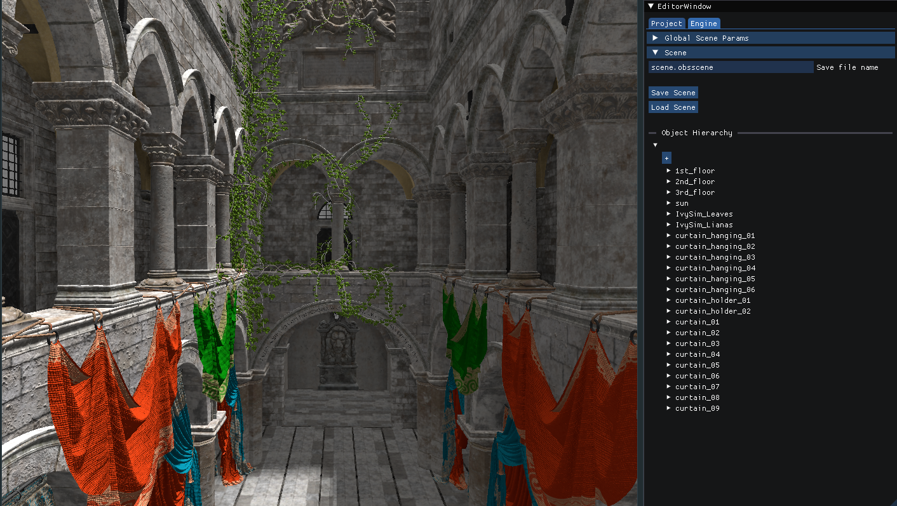

# Obsidian Engine

A Vulkan API game engine developed for education purposes. The only currently supported platform is GNU/Linux.

## Features

### 3D rendering

* lit and unlit forward rendering pipelines
* frustum culling
* transparent objects
* directional lights and spotlights
* dynamic shadows
* screen-space ambient occlusion
* environment maps

### Assets

Custom asset formats for following asset types:
* textures
* meshes
* shaders
* materials
* object prefabs
* scenes

Importer of assets from the common file formats like:
* obj and gltf meshes (partial support)
* png and jpg textures

Additional features include mipmap generation, optional asset compression, material creator and runtime resource manager for loading the assets and uploading them to the GPU.

### Editor

* management of different projects
* loading the scene and changing the scene parameters like ambient lighting
* creation and destruction of game objects in scene
* management of game objects in scene like assigning mesh, material, environment map or different types of lights
* hierarchical game object organization in the scene
* prefab loading

### Additional tools

* support for [Renderdoc](https://renderdoc.org) debugging - manual and programmatic capture
* integration of [Tracy profiler](https://github.com/wolfpld/tracy)
* automatized shader compilation into SPIR-V format and importing as a custom asset

## Linux environment setup

Required packages:
`vulkan-headers vulkan-tools vulkan-validation-layers shaderc sdl2 renderdoc`
